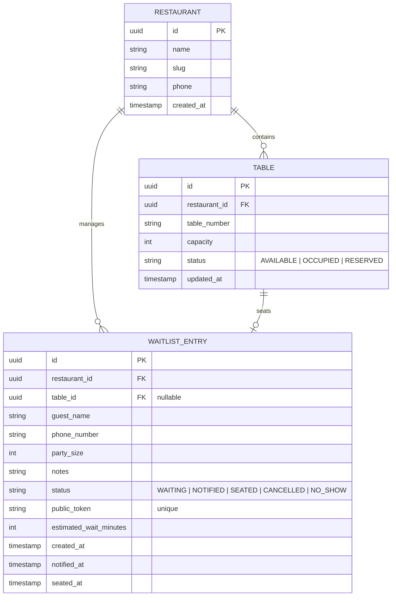

# MaitreQ - Restaurant Waitlist Manager (MVP Specification)

## 1. Executive Summary
**MaitreQ** is a full-stack web application designed to streamline walk-in party management for restaurant front-of-house staff while giving waiting guests transparency into their queue status via real-time mobile tracking.

---

## 2. Problem Statement & Objectives
- **Host / Staff Pain Points:** Paper waitlists cause disorganization, inaccurate wait time estimates, lost revenue due to no-shows, and congestion at the entrance.
- **Guest Pain Points:** Uncertainty about line position and anxiety about missing announcements or losing a spot.
- **MVP Goal:** Deliver a reliable, responsive, and real-time waitlist management system supporting staff queue operations and guest self-service status tracking.

---

## 3. User Personas & Core Workflows

```
  ┌─────────────────────────────────────────────────────────┐
  │                       Guest Journey                     │
  └────────────────────────────┬────────────────────────────┘
                               │
            Scan QR Code / Staff Adds Phone & Name
                               │
                               ▼
            Receive Status Link (Unique Public Token)
                               │
                               ▼
        Live Tracking Page: Position, Wait Time, Alerts
                               │
                               ▼
                  "Table Ready" Notification

                               ▲
                               │
            Update Status / Assign Table / Mark Seated
                               │
  ┌────────────────────────────┴────────────────────────────┐
  │                    Host / Staff Journey                 │
  └─────────────────────────────────────────────────────────┘
```

### 3.1. Host / Front-of-House Staff
1. **Queue Oversight:** View live list of waiting, notified, and seated parties sorted by arrival time.
2. **Add Party:** Enter guest name, phone number, party size, and special requirements (e.g., high chair, outdoor seating, wheelchair accessible).
3. **Status Transitions:**
   - `WAITING` $\rightarrow$ `NOTIFIED` (table ready alert triggered)
   - `NOTIFIED` $\rightarrow$ `SEATED` (party arrived and table assigned)
   - `WAITING` / `NOTIFIED` $\rightarrow$ `CANCELLED` or `NO_SHOW`
4. **Table Assignment:** Associate party with specific table numbers or sections upon seating.

### 3.2. Guest (Public View)
1. **Waitlist Tracking:** Access a mobile-optimized status page via a secure, unguessable token link (`/status/:token`).
2. **Live Updates:** View real-time position in line, estimated wait time, and visual status alerts.
3. **Self-Cancellation (Optional):** Ability to cancel their own waitlist entry if plans change.

---

## 4. Functional Requirements

### 4.1. Waitlist & Queue Management
- **FR-01:** Staff can add new parties with fields: `guest_name`, `phone_number`, `party_size`, `notes`.
- **FR-02:** Parties in the queue have computed dynamic position rankings based on arrival timestamp and queue status.
- **FR-03:** Support one-click status transitions (`WAITING`, `NOTIFIED`, `SEATED`, `CANCELLED`, `NO_SHOW`).
- **FR-04:** Allow editing party details (updating party size or notes) and manual queue reordering if needed.

### 4.2. Guest Status Portal
- **FR-05:** Unique public URL generated per waitlist entry (`/status/<public_token>`).
- **FR-06:** Live status updates reflected immediately without requiring manual browser refresh (via WebSockets / Server-Sent Events / Realtime polling).
- **FR-07:** Clear visual indicators for when table is ready, with instructions to proceed to the host stand.

### 4.3. Table & Capacity Management (Simplified MVP)
- **FR-08:** Pre-configured list of tables with capacity and current state (`AVAILABLE`, `OCCUPIED`, `RESERVED`).
- **FR-09:** Quick assignment of an available table when marking a party as `SEATED`.

---

## 5. Non-Functional Requirements
- **Performance:** Sub-200ms API response times for queue operations.
- **Responsiveness:** Host dashboard optimized for desktop/tablet; Guest status page mobile-first.
- **Reliability & Data Consistency:** Strict state validation ensuring parties cannot be concurrently assigned to the same table.
- **Security:** Public guest tokens must be cryptographically secure UUIDv4 / nanoIDs.

---

## 6. Data Model / Entity Specifications



---

## 7. API Specification (REST & Realtime)

### 7.1. Host Endpoints
- `GET /api/v1/waitlist`: Fetch active waitlist entries.
- `POST /api/v1/waitlist`: Create new waitlist entry.
- `PATCH /api/v1/waitlist/:id/status`: Update party status (`NOTIFIED`, `SEATED`, `CANCELLED`, etc.).
- `PATCH /api/v1/waitlist/:id`: Edit party info.
- `GET /api/v1/tables`: List all tables and occupancy statuses.
- `POST /api/v1/tables`: Add/configure a table.

### 7.2. Guest Endpoints
- `GET /api/v1/status/:token`: Fetch public details for party (name, position, estimated wait, status).
- `POST /api/v1/status/:token/cancel`: Guest self-cancellation.

### 7.3. Real-Time Events
- `waitlist:created`: Broadcasted when new party joins.
- `waitlist:updated`: Broadcasted on status change, table assignment, or reorder.
- `waitlist:status_<token>`: Targeted room/channel event for guest status update.
