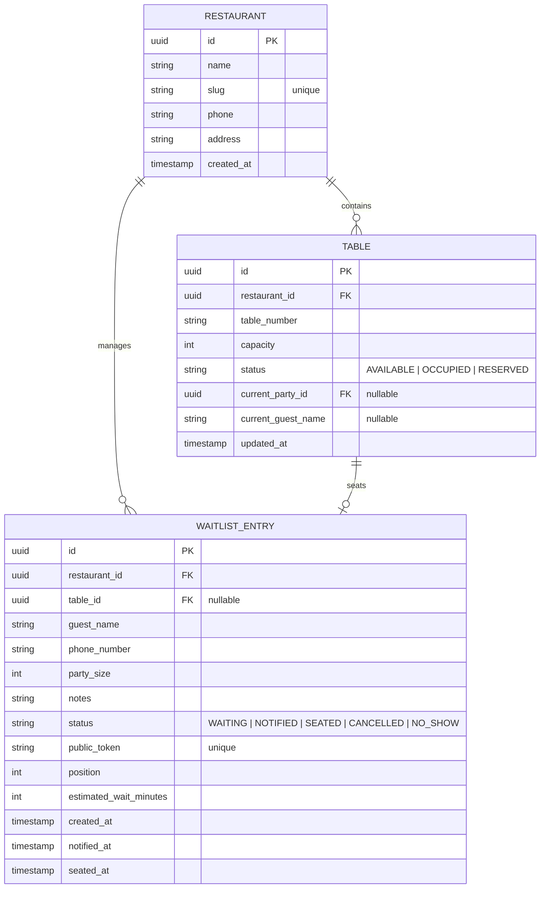

# MaitreQ - Restaurant Waitlist Manager (MVP Specification)

## 1. Executive Summary
**MaitreQ** is a full-stack web application designed to streamline walk-in party management for restaurant front-of-house staff while giving waiting guests transparency into their queue status via real-time mobile tracking.

---

## 2. Problem Statement & Objectives
- **Host / Staff Pain Points:** Paper waitlists cause disorganization, inaccurate wait time estimates, lost revenue due to no-shows, and congestion at the entrance.
- **Guest Pain Points:** Uncertainty about line position and anxiety about missing announcements or losing a spot.
- **MVP Goal:** Deliver a reliable, responsive, and real-time waitlist management system supporting staff queue operations and guest self-service status tracking.

---

## 3. User Personas & Core Workflows

```
  ┌─────────────────────────────────────────────────────────┐
  │                       Guest Journey                     │
  └────────────────────────────┬────────────────────────────┘
                               │
            Scan QR Code / Staff Adds Phone & Name
                               │
                               ▼
            Receive Status Link (Unique Public Token)
                               │
                               ▼
        Live Tracking Page: Position, Wait Time, Alerts
                               │
                               ▼
                  "Table Ready" Notification

                               ▲
                               │
            Update Status / Assign Table / Mark Seated
                               │
  ┌────────────────────────────┴────────────────────────────┐
  │                    Host / Staff Journey                 │
  └─────────────────────────────────────────────────────────┘
```

### 3.1. Host / Front-of-House Staff
1. **Queue Oversight:** View live list of waiting, notified, and seated parties sorted by arrival time and active position.
2. **Add Party:** Enter guest name, phone number, party size, and special requirements (e.g., high chair, outdoor seating, quiet booth).
3. **Status Transitions & State Machine:**
   - `WAITING` $\rightarrow$ `NOTIFIED` (table ready alert triggered, sets `notified_at`)
   - `NOTIFIED` or `WAITING` $\rightarrow$ `SEATED` (party seated, assigns table, marks table `OCCUPIED`, sets `seated_at`)
   - `WAITING` / `NOTIFIED` $\rightarrow$ `CANCELLED` or `NO_SHOW` (clears position)
4. **Table Assignment:** Associate party with specific table numbers and manage table occupancy status (`AVAILABLE`, `OCCUPIED`, `RESERVED`).

### 3.2. Guest (Public View)
1. **Waitlist Tracking:** Access a mobile-optimized status page via a secure, unguessable token link (`/status/:token`).
2. **Live Updates:** View real-time position in line, estimated wait time, and visual status alerts without page reloads.
3. **Self-Cancellation:** Ability to cancel their own waitlist entry if plans change.

---

## 4. Functional Requirements

### 4.1. Waitlist & Queue Management
- **FR-01:** Staff can add new parties with fields: `guest_name`, `phone_number`, `party_size`, `notes`, `estimated_wait_minutes`.
- **FR-02:** Parties in the queue have computed dynamic position rankings based on arrival timestamp and queue status ($1, 2, \dots, N$ for active; $0$ for inactive).
- **FR-03:** Support one-click status transitions (`WAITING`, `NOTIFIED`, `SEATED`, `CANCELLED`, `NO_SHOW`).
- **FR-04:** Allow editing party details and manual queue reordering.

### 4.2. Guest Status Portal
- **FR-05:** Unique public URL generated per waitlist entry (`/status/<public_token>`).
- **FR-06:** Live status updates reflected immediately without requiring manual browser refresh.
- **FR-07:** Clear visual indicators for when table is ready, with instructions to proceed to the host stand.

### 4.3. Table & Capacity Management
- **FR-08:** Pre-configured list of tables with capacity and current state (`AVAILABLE`, `OCCUPIED`, `RESERVED`).
- **FR-09:** Quick assignment of an available table when marking a party as `SEATED` (updates table occupancy atomically).
- **FR-10:** Ability to add new tables and free occupied tables.

---

## 5. Domain Models & Database Schema



---

## 6. Complete REST API Specification

### Common Error Response Format (RFC 7807)
```json
{
  "error": "Human readable error description",
  "code": "ERROR_CODE_STRING",
  "details": null
}
```

### 6.1. Restaurant Endpoints
- **`GET /api/v1/restaurant`**
  - **Response 200 OK:** `Restaurant`

### 6.2. Waitlist Endpoints (Host Operations)
- **`GET /api/v1/waitlist`**
  - **Query Params:** `status` (optional: `ACTIVE`, `WAITING`, `NOTIFIED`, `SEATED`, `ALL`)
  - **Response 200 OK:** `WaitlistEntry[]` (sorted by active position asc, then created_at asc)
- **`POST /api/v1/waitlist`**
  - **Request Body:** `{ guest_name: string, phone_number: string, party_size: number, notes?: string, estimated_wait_minutes?: number }`
  - **Response 201 Created:** `WaitlistEntry`
- **`PATCH /api/v1/waitlist/:id`**
  - **Request Body:** `{ guest_name?: string, phone_number?: string, party_size?: number, notes?: string, estimated_wait_minutes?: number }`
  - **Response 200 OK:** `WaitlistEntry`
- **`PATCH /api/v1/waitlist/:id/status`**
  - **Request Body:** `{ status: "WAITING" | "NOTIFIED" | "SEATED" | "CANCELLED" | "NO_SHOW", table_id?: string }`
  - **Response 200 OK:** `WaitlistEntry`
- **`POST /api/v1/waitlist/reorder`**
  - **Request Body:** `{ from_index: number, to_index: number }`
  - **Response 200 OK:** `WaitlistEntry[]`

### 6.3. Table Endpoints (Host Operations)
- **`GET /api/v1/tables`**
  - **Response 200 OK:** `Table[]`
- **`POST /api/v1/tables`**
  - **Request Body:** `{ table_number: string, capacity: number, status?: "AVAILABLE" | "OCCUPIED" | "RESERVED" }`
  - **Response 201 Created:** `Table`
- **`PATCH /api/v1/tables/:id/status`**
  - **Request Body:** `{ status: "AVAILABLE" | "OCCUPIED" | "RESERVED", free_party?: boolean }`
  - **Response 200 OK:** `Table`

### 6.4. Guest Public Endpoints
- **`GET /api/v1/status/:token`**
  - **Response 200 OK:** `GuestStatusResponse`
- **`POST /api/v1/status/:token/cancel`**
  - **Response 200 OK:** `GuestStatusResponse` (with status `CANCELLED`)

### 6.5. Dashboard Metrics & Demo Controls
- **`GET /api/v1/stats`**
  - **Response 200 OK:** `DashboardStats` (`total_waiting`, `total_notified`, `total_seated_today`, `avg_wait_minutes`, `available_tables`, `total_tables`)
- **`POST /api/v1/demo/reset`**
  - **Response 200 OK:** `{ success: true, message: "Demo data reset successfully" }`

---

## 7. Real-Time Event Layer (SSE / WebSockets)

- **SSE Endpoint:** `GET /api/v1/events` (or `/api/v1/realtime`)
- **Event Envelope:**
```json
{
  "type": "waitlist:created" | "waitlist:updated" | "waitlist:deleted" | "waitlist:status_change" | "tables:updated" | "demo:reset",
  "payload": {},
  "timestamp": "2026-09-09T14:15:00.000Z",
  "sender_id": "server"
}
```
