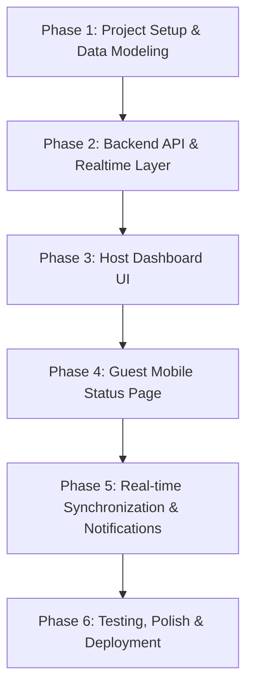

# MaitreQ - Restaurant Waitlist Manager (MVP Implementation Plan)

This document outlines the phased implementation plan, milestones, architectural decisions, and technical tasks for building the **MaitreQ** MVP.

---

## 1. Architecture & Technology Stack Overview

- **Frontend:** Next.js (App Router) / React, Tailwind CSS, Lucide Icons, Shadcn UI / Radix primitives.
- **Backend:** Next.js Route Handlers / Fastify API service with WebSockets / SSE for live subscriptions.
- **Database & ORM:** PostgreSQL with Prisma ORM / Drizzle ORM.
- **State Management & Data Fetching:** TanStack React Query / Zustand.
- **Deployment / Containerization:** Docker, Docker Compose for local development.

---

## 2. Implementation Milestones

---

## 3. Detailed Phase Breakdown

### Phase 1: Project Initialization & Data Layer
- [ ] Initialize repository structure (monorepo or frontend/backend layout).
- [ ] Setup Docker Compose for local PostgreSQL database.
- [ ] Configure ORM (Prisma/Drizzle) schema with `Restaurant`, `Table`, and `WaitlistEntry` models.
- [ ] Write seed script with demo tables and initial waitlist entries.
- [ ] Implement database migrations and automated health checks.

### Phase 2: Core REST API & Business Logic
- [ ] **Waitlist CRUD:**
  - `POST /api/v1/waitlist` (Add party, auto-calculate queue position and public token).
  - `GET /api/v1/waitlist` (Fetch active waiting/notified queue).
  - `PATCH /api/v1/waitlist/:id` (Edit party name, size, notes).
  - `PATCH /api/v1/waitlist/:id/status` (Transition status: `WAITING` $\rightarrow$ `NOTIFIED` $\rightarrow$ `SEATED` / `CANCELLED` / `NO_SHOW`).
- [ ] **Table Management API:**
  - `GET /api/v1/tables` (List tables, capacity, and current occupancy).
  - `POST /api/v1/tables` (Add table).
  - `PATCH /api/v1/tables/:id/status` (Update table status).
- [ ] **Guest Public API:**
  - `GET /api/v1/status/:token` (Public read-only status and queue position).
  - `POST /api/v1/status/:token/cancel` (Guest self-cancellation).

### Phase 3: Host Dashboard (Staff UI)
- [ ] Design and implement the Host Header with summary metrics (Total Waiting, Avg Wait Time, Available Tables).
- [ ] Implement the "Add Party" modal/form with validation.
- [ ] Build the Live Queue table/kanban view with:
  - Party size badges
  - Wait duration counter / timer
  - Action buttons: "Notify Table Ready", "Seat", "Cancel", "Edit"
- [ ] Build the Tables Overview sidebar/grid to view table availability and perform quick table assignments.

### Phase 4: Guest Mobile Status Portal
- [ ] Create mobile-first view at `/status/[token]`.
- [ ] Display real-time position badge (e.g., *"3rd in line"*).
- [ ] Display dynamic estimated wait time and live progress bar.
- [ ] Render prominent alert banner when status changes to `NOTIFIED` (*"Your table is ready! Please see the host"*).
- [ ] Provide "Leave Waitlist" confirmation modal.

### Phase 5: Real-time Communication Layer
- [ ] Implement Server-Sent Events (SSE) or WebSockets channel for dashboard updates.
- [ ] Broadcast events when parties are added, status is updated, or tables are freed.
- [ ] Implement live reconnection and fallback polling on client side.

### Phase 6: Testing, Polish & Verification
- [ ] Unit tests for queue position recalculation and status state machine transitions.
- [ ] Integration tests for Waitlist API endpoints.
- [ ] End-to-end user flow testing (Host adds party $\rightarrow$ Guest watches status $\rightarrow$ Host notifies $\rightarrow$ Guest sees alert $\rightarrow$ Host seats).
- [ ] Mobile responsive styling audit on iOS/Android viewports.
