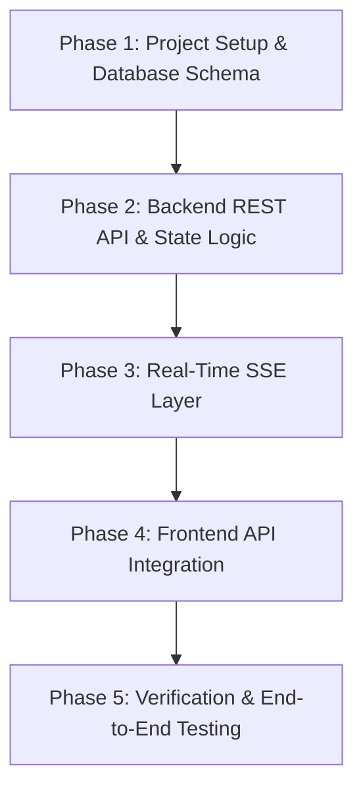

# MaitreQ - Restaurant Waitlist Manager (MVP Implementation Plan)

This document outlines the phased implementation plan, milestones, architectural decisions, and technical tasks for building the **MaitreQ** MVP.

---

## 1. Architecture & Technology Stack Overview

- **Frontend:** React 19, Vite, TypeScript, Tailwind CSS, Lucide Icons, Canvas Confetti.
- **Backend API:** Node.js + Express / Fastify / TypeScript (or Python FastAPI) with REST endpoints and SSE (Server-Sent Events) for real-time pub/sub.
- **Database & ORM:** PostgreSQL / SQLite with Prisma ORM / Drizzle for schema migration, typed queries, and relational data integrity.
- **Data Validation:** Zod schema validation on all request bodies and route parameters.
- **Testing:** Automated API endpoint tests using Vitest / Jest / Supertest.

---

## 2. Implementation Milestones

---

## 3. Detailed Phase Breakdown

### Phase 1: Backend Scaffolding & Database Setup
- [x] Create standardized [`openapi.yaml`](file:///openapi.yaml) specification.
- [x] Initialize `backend/` project structure using `uv` with FastAPI, Pydantic, and CORS configuration.
- [x] Configure Mock Database in `app/database.py` with seed tables and waitlist parties matching the dataset.
- [x] Implement TDD test suite in `tests/test_api.py`.

### Phase 2: Core REST API & Business Logic
- [x] **Data Validation:** Pydantic models in `app/schemas.py` for all request payloads (`CreateWaitlistDTO`, `UpdateWaitlistDTO`, `UpdateStatusDTO`, `CreateTableDTO`, `ReorderQueueDTO`).
- [x] **Waitlist Handlers:**
  - `GET /api/v1/waitlist` (Fetch active and filtered queue).
  - `POST /api/v1/waitlist` (Add party, generate token, calculate dynamic position and wait estimate).
  - `PATCH /api/v1/waitlist/:id` (Edit party metadata).
  - `PATCH /api/v1/waitlist/:id/status` (State machine transitions: `WAITING` $\rightarrow$ `NOTIFIED` $\rightarrow$ `SEATED` / `CANCELLED` / `NO_SHOW`, atomic table updates).
  - `POST /api/v1/waitlist/reorder` (Reorder active queue positions).
- [x] **Table Handlers:**
  - `GET /api/v1/tables` (List tables, capacity, and occupancy).
  - `POST /api/v1/tables` (Create new table).
  - `PATCH /api/v1/tables/:id/status` (Update table status and free occupied parties).
- [x] **Guest Public Handlers:**
  - `GET /api/v1/status/:token` (Public tokenized guest status).
  - `POST /api/v1/status/:token/cancel` (Guest self-cancellation).
- [x] **Stats & Demo Handlers:**
  - `GET /api/v1/stats` (Calculate live dashboard metrics).
  - `POST /api/v1/demo/reset` (Reset database to initial seed data).

### Phase 3: Real-Time Server-Sent Events (SSE) Layer
- [x] Implement SSE endpoint `GET /api/v1/events` with in-memory event broadcaster in `app/events.py`.
- [x] Broadcast events on all mutations (`waitlist:created`, `waitlist:updated`, `waitlist:status_change`, `tables:updated`, `demo:reset`).
- [x] Implement client heartbeat/keep-alive mechanism.

### Phase 4: Frontend & Backend Integration
- [x] Host Dashboard UI (Implemented in `frontent/`).
- [x] Guest Mobile Status Portal (Implemented in `frontent/`).
- [x] Connect `frontent/src/services/api.ts` to the live backend server (`http://localhost:8000/api/v1`).
- [x] Connect SSE subscription in `frontent/` for live multi-client updates.

### Phase 5: Verification & Automated Testing
- [x] Write automated integration tests for all API endpoints and status transition edge cases (`backend/tests/test_api.py`).
- [x] Run end-to-end smoke test (Add Party $\rightarrow$ Watch Guest Status $\rightarrow$ Notify $\rightarrow$ Seat $\rightarrow$ Verify Table Occupancy).
